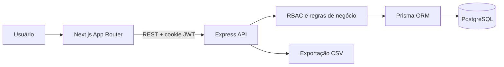
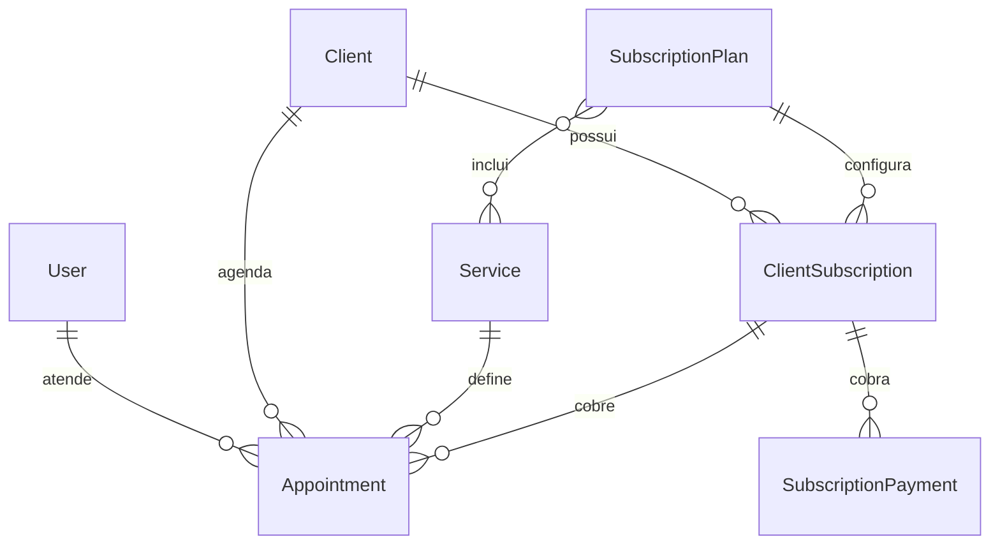

# BarberFlow

> Plataforma interna para gestão completa de barbearias, construída com TypeScript em uma arquitetura monorepo.

[](https://nextjs.org/)
[](https://nodejs.org/)
[](https://www.typescriptlang.org/)
[](https://www.postgresql.org/)
[](https://www.prisma.io/)

O **BarberFlow** centraliza a operação diária de uma barbearia: equipe, catálogo de serviços, clientes, agenda, planos recorrentes, pagamentos, faturamento e comissões. A aplicação separa a experiência do administrador da visão operacional do barbeiro e aplica as mesmas permissões na interface e na API.

O projeto foi desenvolvido com foco em regras de negócio reais, consistência financeira, segurança de acesso e uma identidade visual própria inspirada em barbearias vintage.

## Funcionalidades

### Autenticação e controle de acesso

- Login com sessão JWT armazenada em cookie HTTP-only.
- Perfis `ADMIN` e `BARBEIRO` com autorização no backend.
- Administradores gerenciam toda a operação.
- Barbeiros visualizam somente a própria agenda e os próprios rendimentos.
- Rotas globais de caixa, relatórios e exportação são exclusivas para `ADMIN`.

### Agenda operacional

- Agenda diária organizada em colunas por barbeiro.
- Navegação por data e atualização automática a cada 15 segundos.
- Cadastro rápido de cliente e agendamento no mesmo fluxo.
- Estados `AGENDADO`, `EM_ANDAMENTO`, `CONCLUIDO` e `CANCELADO`.
- Validação de conflito de horários com bloqueio transacional no PostgreSQL.
- Integração com assinaturas para consumir uma visita incluída no plano.

### Serviços e equipe

- CRUD de serviços com nome, descrição, preço e duração.
- Cadastro de barbeiros com expediente e percentual de comissão.
- Desativação lógica para manter o histórico de registros relacionados.
- Snapshot de preço e comissão no agendamento para preservar relatórios históricos.

### Clube de assinaturas

- CRUD de planos mensais.
- Definição de preço, limite de visitas e serviços incluídos em cada plano.
- Vínculo de clientes a planos e geração de cobranças mensais.
- Controle de assinaturas ativas, pausadas e canceladas.
- Registro e reabertura de pagamentos.
- Validação de mensalidade paga, elegibilidade do serviço e saldo mensal antes do uso.
- Separação entre receita recorrente recebida e produção realizada pelo barbeiro.

### Caixa e dashboard financeiro

- Faturamento consolidado do dia, da semana e do mês.
- Quantidade de atendimentos concluídos e ticket médio por cliente.
- Filtros por semana, últimos 15 dias, mês e intervalo personalizado.
- Gráfico de faturamento diário do mês atual.
- Gráfico de distribuição dos serviços mais vendidos.
- Relatório de produção bruta e comissão por barbeiro.
- Consolidação de serviços avulsos e mensalidades pagas sem duplicar receita.
- Exportação do período em CSV com proteção contra formula injection.

### Experiência visual

- Interface responsiva em dark mode.
- Identidade vintage com tipografia **Jolly Lodger**, detalhes em dourado e ilustração vetorial personalizada.
- Estados vazios, feedback de erros e indicadores operacionais.
- Navegação lateral adaptada ao perfil autenticado.

## Arquitetura

O repositório usa **npm workspaces** para manter frontend e backend independentes, compartilhando instalação, scripts e versionamento.



```text
BarberFlow/
├── apps/
│   ├── web/                 # Next.js, React, Tailwind CSS e Recharts
│   │   ├── app/             # Rotas do App Router
│   │   ├── components/      # Dashboard, formulários e módulos
│   │   └── public/          # Identidade visual vetorial
│   └── api/                 # Express e regras de negócio
│       ├── prisma/          # Schema, migrations e seed
│       ├── src/             # API REST, autenticação e relatórios
│       └── tests/           # Teste integrado dos fluxos críticos
├── scripts/                 # Setup e PostgreSQL local para Windows
├── docker-compose.yml       # PostgreSQL para desenvolvimento
└── package.json             # Workspaces e comandos do monorepo
```

### Fluxo de dados

1. O frontend consulta a API REST com `credentials: include`.
2. A API valida a sessão, o perfil do usuário e o payload com Zod.
3. As regras de agenda, assinatura e caixa são executadas no servidor.
4. O Prisma acessa o PostgreSQL e mantém o histórico por migrations.
5. O frontend apresenta os dados em painéis responsivos e gráficos interativos.

## Tecnologias

| Camada | Tecnologias |
| --- | --- |
| Frontend | Next.js 16, React 19, TypeScript, Tailwind CSS 4, Recharts, Lucide React |
| Backend | Node.js, Express 4, TypeScript, Zod |
| Dados | PostgreSQL, Prisma ORM, Prisma Migrate |
| Autenticação | JWT, cookie HTTP-only, bcrypt |
| Segurança | Helmet, CORS restrito, rate limiting, RBAC e validação de origem |
| Infra local | Docker Compose ou PostgreSQL embarcado no Windows |
| Qualidade | TypeScript strict, builds de produção, teste integrado e npm audit |

## Modelo de domínio



As entidades financeiras usam `Decimal` no banco. O agendamento registra o preço e o percentual de comissão vigentes, evitando que alterações futuras no catálogo modifiquem resultados passados.

## Matriz de permissões

| Recurso | ADMIN | BARBEIRO |
| --- | :---: | :---: |
| Agenda de toda a equipe | Sim | Não |
| Própria agenda | Sim | Sim |
| Criar agendamentos e clientes | Sim | Não |
| Gerenciar serviços e equipe | Sim | Não |
| Gerenciar assinaturas e pagamentos | Sim | Não |
| Dashboard financeiro global | Sim | Não |
| Consultar os próprios rendimentos | Sim | Sim |
| Exportar relatório financeiro | Sim | Não |

## Segurança e consistência

- Senhas protegidas com bcrypt e custo configurado em 12 rounds.
- Sessão de 12 horas em cookie HTTP-only, `SameSite=Lax` e `Secure` em produção.
- Rate limiting no endpoint de login.
- Validação de entrada com Zod e limite de tamanho do JSON.
- Helmet, CORS por origem e bloqueio de mutações com origem divergente.
- Autorização aplicada nos endpoints, além da proteção da interface.
- Bloqueios transacionais por barbeiro e assinatura para evitar reservas simultâneas e consumo duplicado.
- Intervalo máximo de 366 dias nas consultas financeiras.
- CSV sanitizado para impedir execução de fórmulas ao abrir o arquivo em planilhas.
- Segredos, banco local, builds e dependências fora do versionamento.

## Como executar

### Pré-requisitos

- Node.js 20.9 ou superior
- npm
- PostgreSQL 16 ou Docker

### Instalação com Docker

```bash
git clone https://github.com/GeanAbreu/BarberFlow.git
cd BarberFlow
npm install
```

Copie o arquivo de ambiente e defina valores seguros:

```bash
cp .env.example apps/api/.env
```

Inicie o banco, aplique as migrations e crie os dados iniciais:

```bash
docker compose up -d
npm run db:migrate
npm run db:seed
npm run dev
```

Acesse `http://localhost:3000` e use o e-mail e a senha definidos em `SEED_ADMIN_EMAIL` e `SEED_ADMIN_PASSWORD`.

### Windows sem Docker

O projeto inclui um PostgreSQL local persistente para facilitar a avaliação no Windows:

```powershell
npm install
npm run db:local:setup
npm run db:migrate
npm run db:seed
npm run dev:local
```

O comando de setup gera credenciais locais e exibe a senha inicial uma vez. Os dados ficam em `.local-data/postgres` e não são versionados.

## Variáveis de ambiente

| Variável | Descrição |
| --- | --- |
| `DATABASE_URL` | Conexão PostgreSQL utilizada pelo Prisma |
| `JWT_SECRET` | Segredo de assinatura JWT com pelo menos 32 caracteres |
| `WEB_ORIGIN` | Origem autorizada no CORS, normalmente `http://localhost:3000` |
| `PORT` | Porta da API, padrão `4000` |
| `SEED_ADMIN_EMAIL` | E-mail do administrador criado pelo seed |
| `SEED_ADMIN_PASSWORD` | Senha inicial do administrador |
| `NEXT_PUBLIC_API_URL` | URL pública da API consumida pelo frontend |

## Scripts principais

| Comando | Ação |
| --- | --- |
| `npm run dev` | Inicia API e frontend em modo de desenvolvimento |
| `npm run dev:local` | Inicia PostgreSQL local, API e frontend |
| `npm run build` | Gera Prisma Client e builds de produção |
| `npm run db:migrate` | Cria ou aplica migrations em desenvolvimento |
| `npm run db:seed` | Cria administrador e serviços iniciais |
| `npm run db:local:setup` | Prepara ambiente e banco local no Windows |
| `npm run test:subscriptions --workspace apps/api` | Valida assinaturas, agenda, financeiro, CSV e RBAC |

## Rotas da aplicação

| Rota | Descrição | Acesso |
| --- | --- | --- |
| `/login` | Autenticação | Público |
| `/agenda` | Agenda diária e operação dos atendimentos | ADMIN e BARBEIRO |
| `/servicos` | Catálogo e preços | ADMIN |
| `/barbeiros` | Equipe, expediente e comissão | ADMIN |
| `/assinaturas` | Planos, assinantes e mensalidades | ADMIN |
| `/financeiro` | Caixa, gráficos, relatórios e exportação | ADMIN |
| `/cadastro` | Cadastro de profissionais | ADMIN |

## Verificação do projeto

Com o PostgreSQL e a API em execução:

```bash
npm run build
npm run test:subscriptions --workspace apps/api
npm audit
```

O teste integrado cria dados temporários, percorre o fluxo de assinatura e agendamento, valida os cálculos financeiros, testa a exportação CSV, confirma o bloqueio das rotas para `BARBEIRO` e remove os registros ao final.

## Decisões técnicas de destaque

- **Monorepo simples:** npm workspaces oferece comandos unificados sem adicionar uma camada de ferramenta desnecessária.
- **Autorização no servidor:** a API define o limite de acesso; ocultar itens da navegação é apenas parte da experiência.
- **Histórico financeiro imutável:** preço e comissão são copiados para o agendamento.
- **Receita e produção separadas:** visitas de assinantes contam para produção e comissão, enquanto o caixa reconhece a mensalidade paga uma única vez.
- **Concorrência controlada:** advisory locks do PostgreSQL protegem agenda e franquia de visitas em requisições simultâneas.
- **Soft delete:** serviços e profissionais desativados continuam disponíveis no histórico.

---

Desenvolvido como um projeto full stack de portfólio, demonstrando arquitetura, modelagem relacional, autenticação, autorização, regras financeiras, concorrência e construção de interfaces orientadas à operação.
