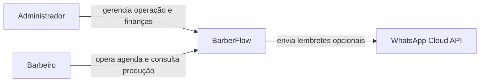
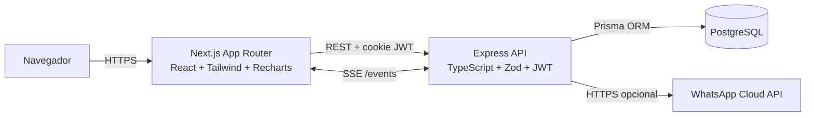
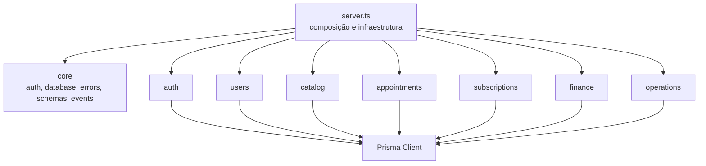
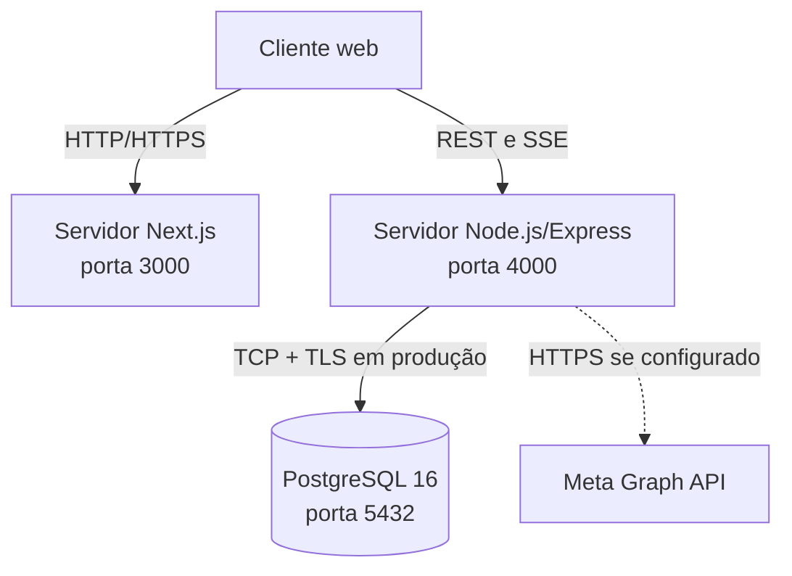

# Arquitetura do sistema

## Visão de contexto



## Contêineres



## Componentes do backend



Cada módulo pode conter:

- **Routes:** define URI, verbo HTTP e cadeia de middlewares.
- **Controller:** traduz HTTP para chamadas da aplicação.
- **Service:** concentra validações e regras de negócio.
- **Repository:** encapsula o acesso persistente.
- **Provider:** integra serviços externos, como WhatsApp.

## Estrutura do monorepo

```text
BarberFlow/
├── apps/
│   ├── api/
│   │   ├── prisma/          # schema, migrations e seed
│   │   ├── src/core/        # infraestrutura compartilhada
│   │   ├── src/modules/     # módulos de domínio
│   │   └── tests/           # testes integrados
│   └── web/
│       ├── app/             # rotas do Next.js App Router
│       ├── components/      # módulos e componentes visuais
│       ├── e2e/             # testes Playwright
│       └── public/          # ativos visuais
├── docs/                    # documentação do produto
├── scripts/                 # PostgreSQL local no Windows
└── .github/workflows/       # integração contínua
```

## Fluxo de uma requisição

1. O navegador envia a requisição com `credentials: include`.
2. Middlewares aplicam headers de segurança, CORS, origem, JSON e autenticação.
3. A rota aplica RBAC e encaminha a requisição ao controller.
4. O payload é validado com Zod.
5. O service executa regras de negócio e coordena transações.
6. O repository ou Prisma acessa o PostgreSQL.
7. Erros conhecidos são convertidos em respostas HTTP padronizadas.
8. Mudanças de agenda publicam evento SSE para os usuários autorizados.

## Implantação



## Decisões arquiteturais

| Decisão | Justificativa |
| --- | --- |
| npm workspaces | Mantém frontend e backend no mesmo ciclo de versão com baixa complexidade operacional |
| REST + SSE | REST atende comandos e consultas; SSE fornece atualização unidirecional simples para a agenda |
| Prisma ORM | Schema tipado, migrations reproduzíveis e suporte a transações PostgreSQL |
| Cookie HTTP-only | Reduz exposição do token ao JavaScript do navegador |
| Snapshot financeiro | Preserva preço e comissão históricos mesmo após alterações cadastrais |
| Advisory locks | Serializa decisões concorrentes de agenda e franquia sem depender do frontend |
