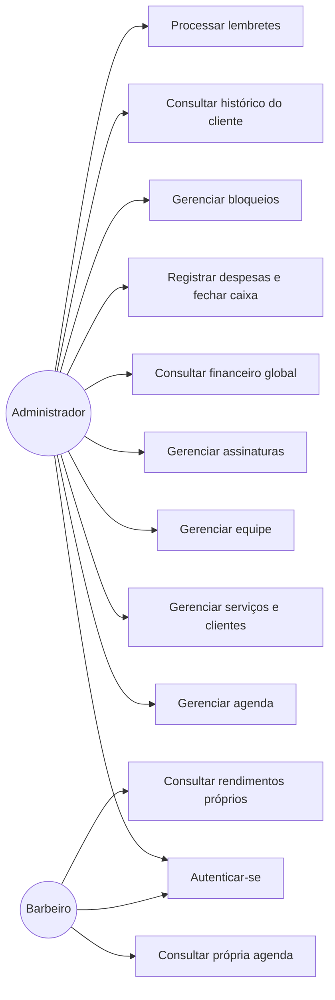
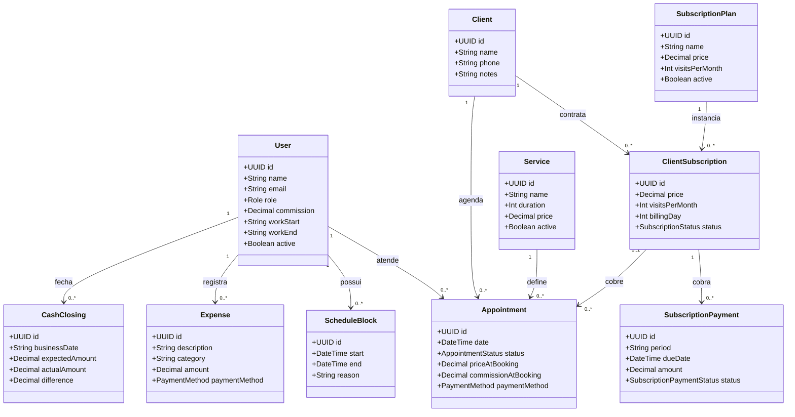
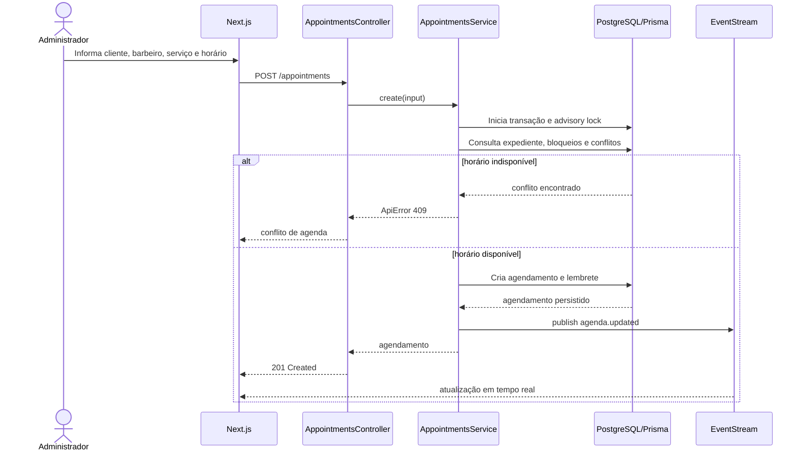
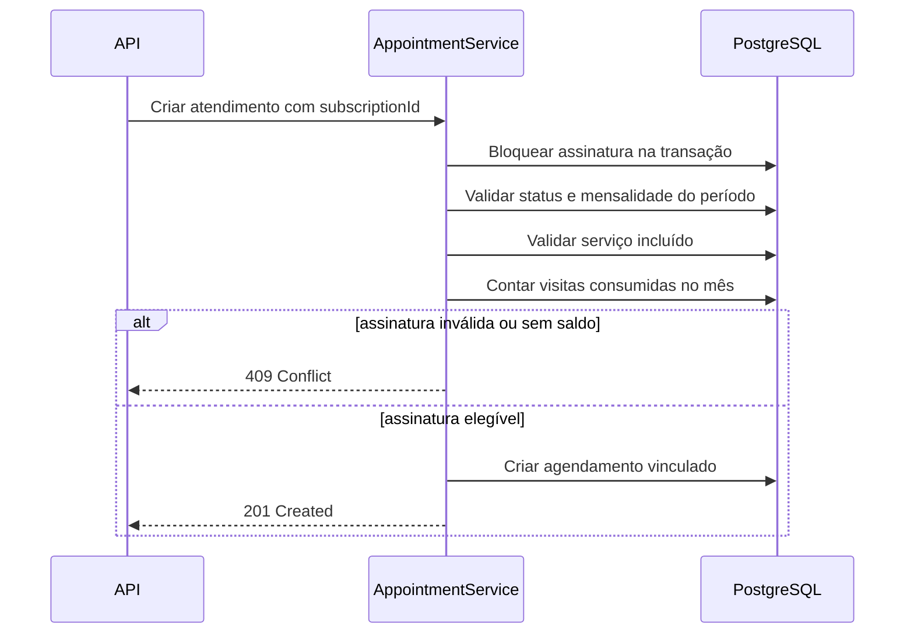
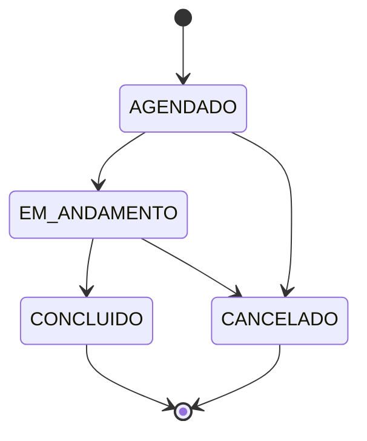
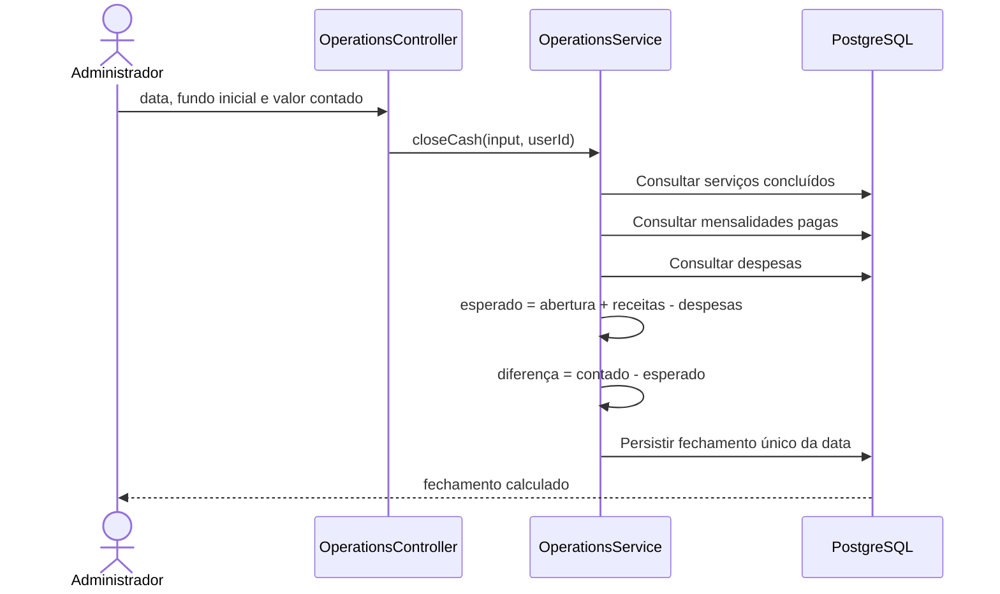

# Diagramas UML

## Casos de uso

## Diagrama de classes do domínio

## Sequência de criação de agendamento

## Sequência de uso de assinatura

## Fluxo operacional recomendado do atendimento

A API aceita correções administrativas de estado. O fluxo abaixo representa a sequência usada pela operação e pela interface.

## Sequência de fechamento de caixa

