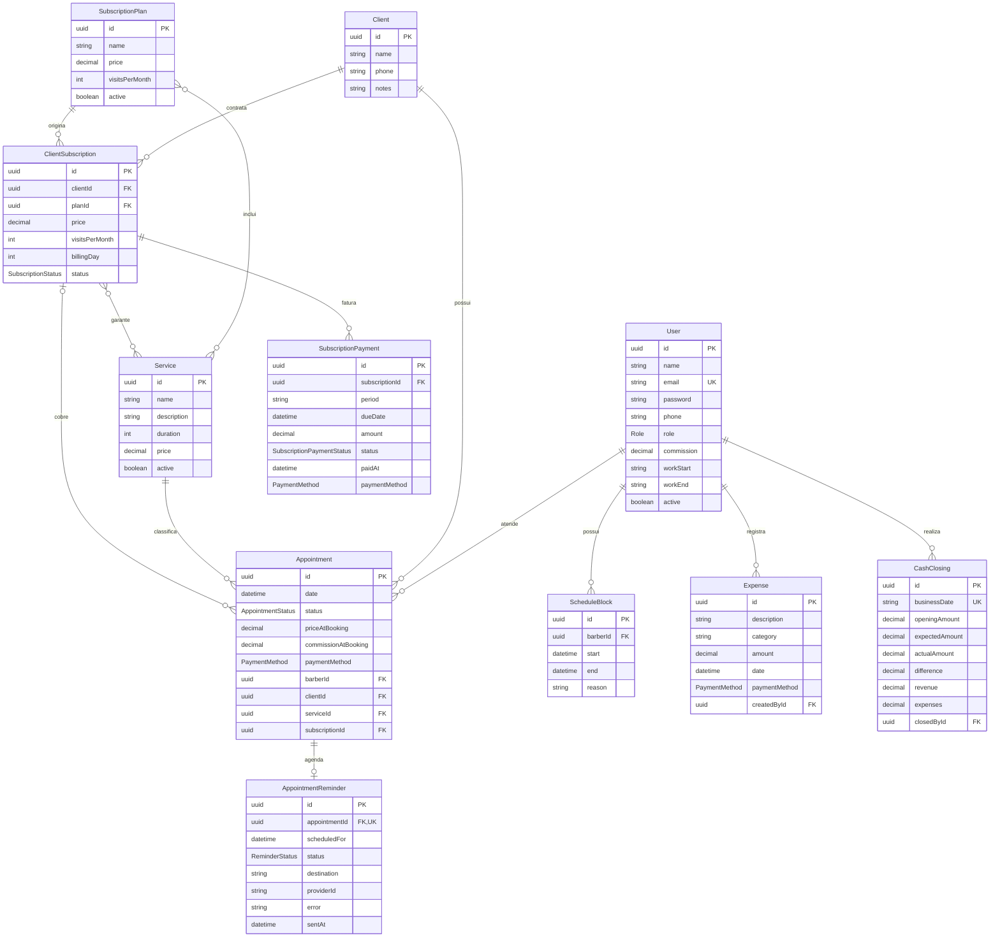

# Modelo de dados e DER

## Diagrama entidade-relacionamento

## Entidades

| Entidade | Finalidade |
| --- | --- |
| `User` | Credenciais, perfil, expediente e comissão do profissional |
| `Client` | Identificação, contato, observações e relacionamentos do cliente |
| `Service` | Catálogo com duração e preço vigente |
| `Appointment` | Atendimento e snapshots financeiros utilizados nos relatórios |
| `SubscriptionPlan` | Modelo comercial reutilizável de assinatura |
| `ClientSubscription` | Contrato específico do cliente com snapshots do plano |
| `SubscriptionPayment` | Cobrança mensal e reconhecimento da receita recorrente |
| `ScheduleBlock` | Indisponibilidade do profissional em um intervalo |
| `Expense` | Saída financeira operacional |
| `CashClosing` | Consolidação imutável do caixa de uma data |
| `AppointmentReminder` | Estado de entrega do lembrete de um atendimento |

## Enums

- `Role`: `ADMIN`, `BARBEIRO`.
- `AppointmentStatus`: `AGENDADO`, `EM_ANDAMENTO`, `CONCLUIDO`, `CANCELADO`.
- `SubscriptionStatus`: `ATIVA`, `PAUSADA`, `CANCELADA`.
- `SubscriptionPaymentStatus`: `PENDENTE`, `PAGO`.
- `PaymentMethod`: `DINHEIRO`, `PIX`, `CARTAO_CREDITO`, `CARTAO_DEBITO`, `OUTRO`.
- `ReminderStatus`: `PENDENTE`, `ENVIADO`, `FALHOU`, `IGNORADO`.

## Restrições e índices importantes

| Estrutura | Finalidade |
| --- | --- |
| `User.email` único | Impede credenciais duplicadas |
| `SubscriptionPayment(subscriptionId, period)` único | Impede duas mensalidades para o mesmo período |
| `CashClosing.businessDate` único | Garante um fechamento por data |
| `AppointmentReminder.appointmentId` único | Garante no máximo um lembrete por atendimento |
| `Appointment(barberId, date)` | Otimiza consultas de agenda por profissional |
| `Appointment(date, status)` | Otimiza relatórios e consultas operacionais |
| `ScheduleBlock(barberId, start, end)` | Otimiza validação de indisponibilidade |
| `SubscriptionPayment(status, dueDate)` | Otimiza acompanhamento de cobranças |

## Estratégia financeira

Campos monetários utilizam `Decimal` no PostgreSQL. `Appointment.priceAtBooking` e `commissionAtBooking` registram os valores vigentes na criação do atendimento. `ClientSubscription` preserva preço, franquia e serviços contratados, evitando que edições futuras no plano alterem contratos existentes.

O schema é evoluído exclusivamente por migrations em `apps/api/prisma/migrations`.
