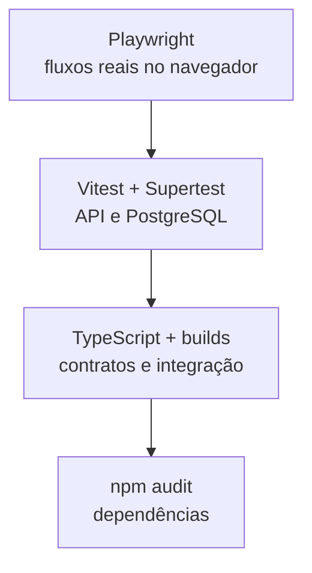

# Estratégia de testes e qualidade

## Pirâmide de testes

## Cobertura implementada

### API integrada

- Rejeição de acesso sem autenticação.
- Bloqueio do dashboard financeiro para `BARBEIRO`.
- Criação e autenticação de usuário.
- Bloqueio de agendamento em período indisponível.
- Detecção de sobreposição entre atendimentos.
- Snapshot de preço e percentual de comissão.
- Cálculo de produção bruta e comissão.
- Consulta isolada dos rendimentos do barbeiro.
- Registro de despesa e fechamento de caixa.
- Histórico detalhado do cliente.
- Processamento seguro de lembrete sem provedor configurado.
- Fluxo de assinatura, mensalidade, agenda, relatório, CSV e RBAC.

### Interface com Playwright

- Exibição de erro para credenciais inválidas.
- Login administrativo.
- Navegação pela agenda.
- Acesso à operação e ao caixa.
- Acesso ao dashboard financeiro e ação de exportação.

## Comandos

| Comando | Verificação |
| --- | --- |
| `npm run build` | Prisma Client, TypeScript da API e build Next.js |
| `npm test` | Testes Vitest e Supertest |
| `npm run test:subscriptions --workspace apps/api` | Smoke test de assinaturas e financeiro |
| `npm run test:e2e` | Testes Playwright no Chromium |
| `npm audit` | Vulnerabilidades conhecidas nas dependências |

## Integração contínua

O workflow `.github/workflows/ci.yml` executa em pushes para `main` e pull requests:

1. Inicializa PostgreSQL 16 isolado.
2. Instala dependências com `npm ci`.
3. Aplica todas as migrations.
4. Executa o seed de avaliação.
5. Gera builds de produção.
6. Executa testes integrados.
7. Instala o Chromium do Playwright.
8. Executa testes de interface.
9. Audita dependências.

## Dados de teste

Os testes criam registros com identificadores únicos, exercitam o sistema pela interface HTTP e removem os dados ao final. O ambiente de CI usa credenciais exclusivas e efêmeras.
